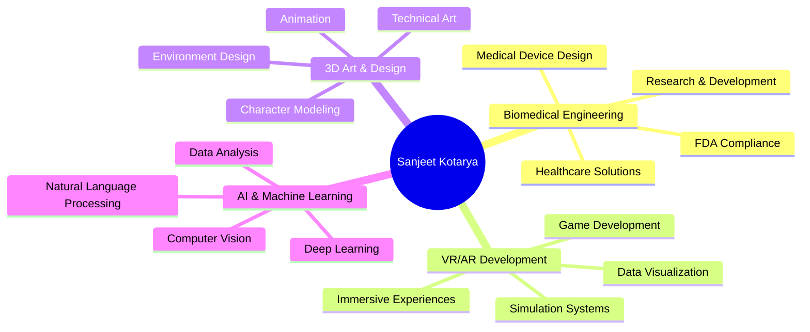

# 🌟 Subhadip Sinha

### 🧬 AIML Engineer × 🎬Video Editor × 🎨 Digital Artist

*Building the future through immersive technology and innovative solutions*

<h1 align="center">
  
</h1>

---

## 🛠️ Tech Arsenal

### 💻 Programming Languages

### 🎮 Game Engines & 3D

### 🧠 AI & Data Science

### 🔧 Tools & Platforms

---

## 📊 GitHub Analytics

<table>
<tr>
<td width="50%">

</td>
<td width="50%">

</td>
</tr>
</table>

### 🏆 GitHub Trophies

---

## 🌟 Professional Focus Areas

---

## 🎯 Current Focus

| 🔥 **Currently Working On** | 🎓 **Learning** | 🎯 **Goals 2025** |
|:---|:---|:---|
| Advanced VR medical training simulations | WebXR development | Launch 3 major VR projects |
| AI-powered 3D model generation | Real-time ray tracing | Contribute to open source |
| Biomedical device prototyping | Quantum computing basics | Speaking at tech conferences |

---

## 📈 Contribution Activity

---

### 💌 Let's Build Something Amazing Together!

*"The future belongs to those who believe in the beauty of their dreams."*

**📧 Email:** [sanjeetkotarya@gmail.com](mailto:your.sanjeetkotarya@gmail.com)  
**🌍 Location:** Available for remote collaboration worldwide

---

  

